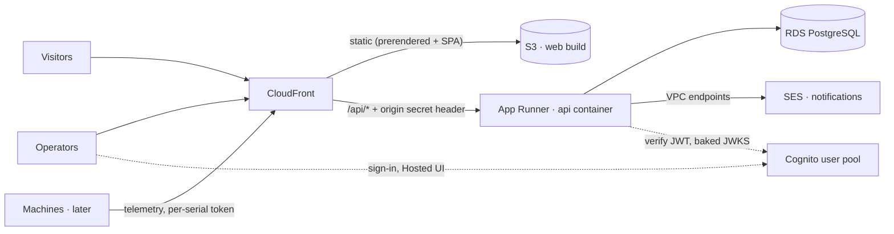
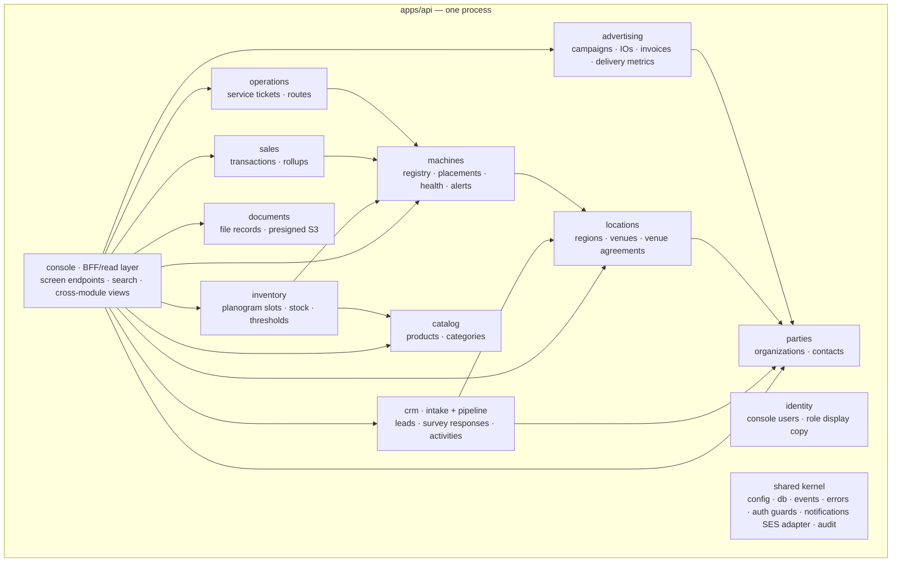
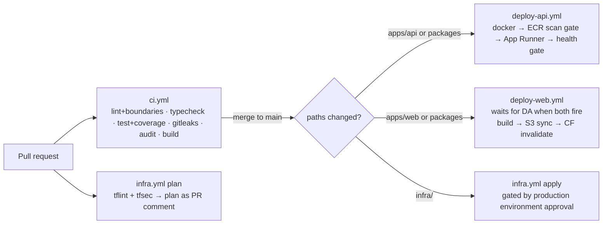

# AutoVend — System Architecture (v0.2)

Status: **approved 2026-08-19** (open questions in §13 still pending) · Companion docs: [PRD.md](PRD.md), [ROADMAP.md](ROADMAP.md)
v0.2 incorporates the architect + security design reviews; machines are simulator-first (§4) until hardware specs exist.

## 1. Shape of the system

A **modular monolith**: one deployable backend service with hard internal module boundaries,
one Postgres database with a schema per module, one React frontend, one repo. Scale-out paths
exist (split a module → service, add queues) but are deliberately not built until needed.



Why this shape:

- **One deploy, one DB** keeps a solo-dev operation cheap and debuggable.
- **Module boundaries enforced in CI** (not by network calls) keep the CRM from becoming a
  ball of mud — and make a later extraction mechanical, not archaeological.
- Serving `/api/*` through CloudFront gives a **same-origin API** (no CORS), one TLS cert,
  one domain — provided the origin is locked (§10.1).

## 2. Repository layout (pnpm workspaces monorepo)

```text
AutoVend/
├── apps/
│   ├── web/                    # React Router v7 app — marketing (prerendered) + console (SPA)
│   └── api/                    # NestJS modular monolith
├── packages/
│   └── contracts/              # zod schemas + ts-rest contracts (builds to dist/, real exports map)
├── infra/                      # Terraform (bootstrap/ + modules: dns, frontend, api, database, github-oidc)
├── docs/                       # design, ADRs, runbooks
├── prototype/                  # ← current repo-root files move here, kept as untouched reference
├── .github/workflows/          # ci.yml, deploy-web.yml, deploy-api.yml, infra.yml
├── pnpm-workspace.yaml
└── CLAUDE.md                   # AutoVend-specific agent instructions (this repo ≠ AI-Workspace rules)
```

Notes that save a day later:

- `prototype/**` is excluded from eslint/tsconfig in the same commit that creates the
  workspace, or CI never goes green (the prototype uses `window.*` globals by design).
  `AutoVend Website.html` (stray export) moves into `prototype/` too.
- `packages/contracts` **builds to `dist/`** with proper `exports`/`types`; the api Dockerfile
  is multi-stage using `pnpm deploy --filter=api --prod` — a plain `pnpm install` inside
  `apps/api` cannot resolve `workspace:*` deps.
- Media: **done 2026-08-20** — the 16 MB of unreferenced source renders (`uploads/`) were
  `git filter-repo`'d out of history (originals archived off-repo, S3 later). Referenced
  media stays in `prototype/assets/` so the frozen prototype keeps working; web-sized copies
  land in `apps/web/public/` during the Phase 1 port. Convention going forward: source media
  lives in S3, not git.

## 3. Frontend (`apps/web`) — build focus #1

**Stack:** React 18 + TypeScript + **React Router v7 framework mode** (version pinned) with
`ssr: false` and `prerender` for the public routes. Output is fully static (S3-hostable);
marketing pages ship as real HTML for SEO, `/console/*` behaves as a plain SPA.

| Concern        | Choice                                                                           | Notes                                                                                                                                                    |
| -------------- | -------------------------------------------------------------------------------- | -------------------------------------------------------------------------------------------------------------------------------------------------------- |
| Routing        | RR7 file routes                                                                  | Clean URLs. A tiny root-route shim redirects legacy `#/x` hash links to `/x`                                                                             |
| Public routes  | prerendered                                                                      | build-time `loader` allowed; content baked at deploy                                                                                                     |
| Console routes | SPA only — **never prerendered**, `noindex`                                      | `clientLoader` + `HydrateFallback` pattern; own fallback HTML so deep links don't carry marketing meta                                                   |
| Server state   | TanStack Query over ts-rest client                                               |                                                                                                                                                          |
| Client state   | React state/context                                                              | no global store until a real need appears                                                                                                                |
| URL state      | search params                                                                    | console filters (machine status, date ranges)                                                                                                            |
| Styling        | port `styles.css` token system; extract prototype inline styles to component CSS | themes/density survive; fonts self-hosted via Fontsource, two families max                                                                               |
| Forms          | React Hook Form + zod                                                            | form schemas **derived** from contract schemas (`.extend()`/`.transform()` in `lib/forms`) — forms want `""`/string dates, the API wants `undefined`/ISO |

**Escape hatch, pre-decided:** if prerender/hydration fights back for more than ~2 days of
work, split into Astro (marketing) + plain Vite SPA (console). Named trigger, cheap decision.

### The seam that makes "frontend first" non-throwaway

The console reads through a typed data layer implementing the **view contracts** (§5). Until
the API exists, a fixtures adapter serves sample data behind the same interface, and it
**simulates reality**: configurable `{ delayMs, failRate, empty }` so every list and stat card
is built with loading, error-with-retry, and empty states from day one (the prototype has none
— e.g. `SparkBars` NaNs on empty input). Each endpoint flips fixtures → HTTP independently as
the backend lands, and **every flip deletes the fixture it replaces**.

Distinct from fixtures: `features/demo/demoData.ts` — a **frozen, intentionally fake dataset
that permanently backs the public `/dashboard-demo` page**. It is never wired to the API.
The real console lives at `/console` behind real auth (§6); the demo gate stays a marketing
feature. This split prevents the public demo from ever leaking real fleet/revenue data.

The tweaks panel (theme/density switcher) is kept as a dev-only tool, excluded from prod builds.

## 4. Backend (`apps/api`) — NestJS modular monolith

### Module map



Solid arrows = allowed compile-time dependencies (facades only). Anything not drawn is
**forbidden and fails CI**. Notable non-arrows, by design:

- **`sales ↛ catalog`** — transactions snapshot `productNameAtSale` + `unitPriceMinor`;
  history must not re-point at a live taxonomy.
- **Survey responses store contract enum codes**, not catalog rows — historical answers keep
  their meaning when the taxonomy changes.
- **No module imports `identity`** — `assignee`/`operator`/`acknowledgedBy` are stored as
  plain `userId` values; the `console` BFF resolves display names in one batch. Same rule for
  `documentId` references.

### Boundary rules

```text
apps/api/src/modules/crm/
├── api/  application/  domain/  infra/     # full anatomy for modules with real invariants
├── crm.module.ts
└── index.ts                                 # PUBLIC FACADE — the only importable file
```

1. **Facade-only imports**, enforced by `eslint-plugin-boundaries` as a CI-failing lint error.
   The `console` module is the one sanctioned many-to-one node (it may depend on every facade;
   nothing depends on it). Thin modules (`catalog`, `identity`) may be flat
   `schema.ts + service.ts + index.ts` until they earn the full anatomy.
2. **Schema-per-module in one Postgres.** Module `crm` owns pg schema `crm`. No cross-schema
   FKs or joins from another module's code — with one published exception: a module may
   export **read-only SQL views** (e.g. `machines.v_machine_summary`) as part of its public
   contract; only the `console` module may join published views. Everything else goes through
   facades or events.
3. **In-process typed domain events** (shared-kernel contracts, EventEmitter2 transport):
   `lead.created`, `survey.submitted`, `machine.went-offline`, `stock.below-threshold`,
   `ticket.opened`. Handlers idempotent. Upgrade path when durability is needed: outbox table
   → SQS — a transport swap, not a redesign.
4. **Field conventions:** uuid v7 PKs + `created_at/updated_at` everywhere; machines keep the
   human serial (`AV-0421`) as a natural unique key. **Money is integer minor units
   (`bigint` cents) — never float.** **Time is `timestamptz`;** `Region` carries an IANA
   `timeZone` and sales rollups key on venue-local dates (a Seattle 9 pm sale is not
   tomorrow's revenue).

### Core data model (per owning module)

| Module      | Entities (abridged)                                                                                                                                                                                                                                                                                                                                                                                                                         |
| ----------- | ------------------------------------------------------------------------------------------------------------------------------------------------------------------------------------------------------------------------------------------------------------------------------------------------------------------------------------------------------------------------------------------------------------------------------------------- |
| parties     | `Organization {name, kind: venue-host\|advertiser}` · `Contact {orgId?, name, email, phone}`                                                                                                                                                                                                                                                                                                                                                |
| crm         | `Lead {type: placement\|advertising\|suggestion\|general\|demo, status: new→contacted→qualified→won\|lost, assigneeUserId?, convertedOrganizationId?, convertedVenueId?}` — filterable fields (`venueType`, `trafficBand`, `industry`, `budgetBand`, `city`, `state`) are **typed columns**; jsonb holds free text only · `SurveyResponse {venueText, venueType, categoryCodes[], dietaryCodes[], suggestion, email?}` · `Activity` (notes) |
| locations   | `Region {name, state, status: active\|expansion, timeZone, mapX, mapY, density}` · `Venue {name, venueType, address, regionId, trafficBand, status: prospect→contracted→live\|churned, orgId?}` · `VenueAgreement {venueId, revSharePct\|fixedFeeMinor, termStart, termEnd, documentId?}` _(Phase 4)_                                                                                                                                       |
| machines    | `Machine {serial, model, source: simulated\|hardware, status, healthPct}` · `Placement {machineId, venueId, from, to?}` (history) · `Alert {machineId, level, message, at}` — **immutable telemetry signal, no workflow fields**                                                                                                                                                                                                            |
| catalog     | `Product {sku, name, category, dietaryTags[]}`                                                                                                                                                                                                                                                                                                                                                                                              |
| inventory   | `PlanogramSlot {machineId, slotNo, sku, capacity, currentQty, threshold}`                                                                                                                                                                                                                                                                                                                                                                   |
| sales       | `SaleTxn {machineId, sku, productNameAtSale, unitPriceMinor, qty, at, paymentType}` · `DailySalesRollup` (venue-local dates)                                                                                                                                                                                                                                                                                                                |
| advertising | `Campaign {orgId, flightStart, flightEnd, status}` · `CampaignMetricsDaily {impressions, qrScans}` · `InsertionOrder`, `Invoice {status: draft\|sent\|paid\|overdue}` _(Phase 4)_                                                                                                                                                                                                                                                           |
| operations  | `ServiceTicket {machineId, severity, source: telemetry\|manual, status, assigneeUserId?, acknowledged…}` — **the only human workflow object for machine problems** (`machine.went-offline` auto-opens one) · `Route {date, operatorUserId, stops[]}`                                                                                                                                                                                        |
| documents   | `Document {ownerType, ownerId, s3Key, filename, contentType, sizeBytes, uploadedBy}` — presigned PUT/GET against a private bucket, MIME/size allowlist server-side; never proxied through the API                                                                                                                                                                                                                                           |
| identity    | `User {email, cognitoSub, role}` — **role is a display copy; Cognito groups are authoritative** (§6)                                                                                                                                                                                                                                                                                                                                        |

**Lead conversion rule:** a Lead is an **immutable snapshot** of what was submitted. Org /
Contact / Venue records are created (or linked to existing ones — dedupe UI) only by an
explicit `convertLead` use case on transition to `qualified`. This prevents both org sprawl
("Equinox" ×3) and a dead parties table.

### Data layer

- **Drizzle ORM** + `drizzle-kit`, schemas namespaced per module. Guardrails:
  - explicit barrel `src/db/schema.ts` importing every module schema by name (the one
    sanctioned infra-level exception to the facade rule) + `schemaFilter` in drizzle config —
    protects against drizzle-kit emitting DROPs when a glob misses a file;
  - CI fails any generated migration containing `DROP TABLE|SCHEMA|COLUMN` unless the PR
    carries a `destructive-migration` label.
- **Migrations are expand/contract and forward-only.** App Runner deploys are rolling (old +
  new containers overlap), so every migration must keep version N−1 of the code working;
  drops/renames ship a release after the code stops using them. Runner: on boot behind a pg
  advisory lock with `lock_timeout`/`statement_timeout`, gated by `RUN_MIGRATIONS=true`.
  **Rollback is code-only** (redeploy previous image); a bad migration is fixed by a forward
  migration, never by rolling the schema back. (Accepted solo-dev tradeoff, documented: the
  runtime DB credential holds DDL rights while migrations run on boot; revisit if the
  service splits.)
- Public lead/survey endpoints write synchronously (a lost lead is the worst failure mode),
  accept an **`Idempotency-Key`** (replay returns the original record — retries and
  double-clicks are safe), then emit events for notification fan-out.
- **One-off tasks** (seeds, backfills, ad-hoc SQL) have a home: SSM Session Manager
  port-forward through an on-demand t4g.nano bastion (stopped by default, ~$0 when off).
  GitHub runners cannot reach the private RDS — which is also _why_ migrations run on boot.

### Fleet simulator — machines before hardware specs exist

There are no vending-machine spec documents yet (telemetry protocol, payment hardware, slot
geometry all TBD), so the platform is **simulator-first**:

- Machine modeling stays hardware-agnostic: `model` is free text, planograms are a generic
  slot grid, and no schema or contract assumes a device protocol.
- `tools/simulator` (workspace package) generates a realistic mock fleet: venue-type traffic
  curves, per-slot stock depletion, vend-fail/door/offline events, restock resets. Two modes —
  **one-shot** (seed N machines + 90 days of history) and **tick** (ongoing live events for
  demos and dev).
- In Phase 3 it writes through the same module facades the console uses; in Phase 5 it becomes
  the **first client of the telemetry ingest API**, validating per-serial auth, idempotency,
  and payload shape before any hardware exists. Onboarding real machines is a source swap,
  not a redesign.
- Simulated machines carry `source = 'simulated'` so they can coexist with real ones later
  and be purged wholesale.

## 5. API contract (`packages/contracts`)

Two layers, different owners:

| Layer                            | Owned by                                | Contents                                                                                                      |
| -------------------------------- | --------------------------------------- | ------------------------------------------------------------------------------------------------------------- |
| `contracts/<module>.resource.ts` | the backend module that owns the schema | canonical resource shapes (`Lead`, `Machine`, `Venue`…)                                                       |
| `contracts/console.view.ts`      | the `console` BFF                       | screen-shaped read models (`MachineListRow`, `ConsoleOverview`) — what the frontend/fixtures actually consume |

This split is what keeps "the frontend defines the contract" from becoming "the frontend
defines the backend's joins": fixtures conform to **view** contracts; domain modules never
contort to screen shapes.

- **zod + ts-rest**; API implements via `@ts-rest/nest` with **`validateResponses` enabled**
  (in dev/test at minimum) so response schemas are enforcement, not documentation. ts-rest and
  zod majors pinned together.
- **Enums are code values, never display strings** — `venueType`, `trafficBand`
  (`under_200`…), `leadType`, `industry`, `budgetBand`, `machineStatus`, `productCategory`,
  `dietaryTag` — with exported `LABELS` maps for the UI. (The prototype submits labels like
  `"200 – 500"` with an en dash; that must not reach the database.)
- **Conventions defined once:** `Paginated<T>` envelope (cursor for leads/sales, offset for
  small sets), standard `sort`/`filter` param shape, RFC 7807-style error body. Public-route
  errors are generic — no stack traces, no constraint text (a duplicate-key message must not
  confirm who has already contacted us).
- Versioned under `/api/v1`; OpenAPI generated from the contract.
- **Contract changes are additive-only within a release** (same expand/contract discipline as
  migrations) — this is what makes the independent web/api deploy pipelines safe when both
  trigger on `packages/**`.

## 6. AuthN / AuthZ

- **Cognito Hosted UI (Managed Login), Authorization Code + PKCE, public client (no secret).**
  No password handling, no `amazon-cognito-identity-js` (maintenance mode, tokens in
  XSS-reachable storage — which matters here because the console renders attacker-supplied
  lead text). MFA (TOTP) **required for the `admin` group**.
- Access tokens verified in a **global deny-by-default Nest guard** with explicit `@Public()`
  opt-out for lead/survey routes (opt-in guards are how Phase 4 routes ship unauthenticated
  by accident). Verifier pins `tokenUse: 'access'`, `clientId`, `userPoolId`; **JWKS baked at
  build/boot** (static, rarely rotated) so JWT verification needs no runtime Cognito egress.
- **Cognito groups are the authoritative role source** (`admin`, `operator`, `field-tech`) →
  `@Roles()` guard. `identity.User.role` is a display copy reconciled on group change; users
  are JIT-provisioned into `identity` on first authenticated request.
- **Revocation window = access-token TTL, set to 15–30 min.** Offboarding/compromise response
  is documented as "disable user + wait one TTL"; a deny-list keyed by `sub` gets added only
  if that window ever becomes unacceptable.
- Role scoping is route-level, not UI-level: `field-tech` cannot reach `crm` lead PII at all.
  Client-side route guards are UX only — the console bundle is public (normal for a SPA);
  every console endpoint enforces JWT + role server-side.
- Ordering gotcha for Phase 2/3: a Cognito **custom domain** needs an ACM cert in us-east-1
  _and_ an existing A record on the parent domain; Cognito email must be wired to SES (its
  default sender caps at 50/day).
- Future machine telemetry auth is **not Cognito**: per-serial API tokens with rotation, an
  unattended-device model (Phase 5).

## 7. AWS topology

Single account (fresh one recommended — clean IAM/billing boundary **and** a new account's
12-month RDS free tier covers `db.t4g.micro` + 20 GB, i.e. most of year-one DB cost), region
`us-east-1`. Environments: **prod** now; staging deferred (§13 Q4) — mitigated by rehearsing
every migration against a restored prod snapshot locally (runbook item), not by paying for a
second environment.

| Concern        | Service                                                                  | Notes                                                                                                                                                                                                                                                                |
| -------------- | ------------------------------------------------------------------------ | -------------------------------------------------------------------------------------------------------------------------------------------------------------------------------------------------------------------------------------------------------------------- |
| Static hosting | S3 (private, BPA on, versioned) + CloudFront (OAC)                       | bucket policy `AWS:SourceArn` pinned to the distribution ARN; TLS floor `TLSv1.2_2021`                                                                                                                                                                               |
| API runtime    | **App Runner** (ECR image)                                               | 0.5 vCPU / 1 GB (NestJS boot + migrations need headroom), min 1 / max 3; generous health-check grace; VPC connector for RDS                                                                                                                                          |
| VPC egress     | **Interface endpoints** for SES + SSM (single-AZ, ~$7/mo each)           | the VPC connector routes _all_ egress into the VPC — without endpoints, SES/SSM calls hang. No NAT Gateway (~$33/mo, budget-breaking); JWKS baking (§6) removes the Cognito egress need. Escape hatch if more endpoints pile up: fck-nat t4g.nano (~$4/mo)           |
| Database       | RDS PostgreSQL 16 `db.t4g.micro`, single-AZ, 20 GB gp3                   | `storage_encrypted` **from first apply** (cannot be enabled in place later), `publicly_accessible=false` explicit, `deletion_protection=true`, `rds.force_ssl=1` + `sslmode=verify-full` in the app, SG ingress = the VPC-connector SG (never a CIDR), 7-day backups |
| Email          | SES domain identity (DKIM + custom MAIL FROM subdomain)                  | **send-only**; receiving is Google Workspace on the same domain (coexists — apex MX/TXT untouched, §13 Q3); SES **sandbox exit is a human-reviewed request — file it in Phase 1**                                                                                    |
| Auth           | Cognito user pool + Hosted UI                                            | see §6                                                                                                                                                                                                                                                               |
| Registry       | ECR, scan-on-push                                                        | lifecycle keep last 10                                                                                                                                                                                                                                               |
| DNS / TLS      | Route 53 (existing autovendsystems.com zone, **data source only**) + ACM | apex + www → CloudFront; Google Workspace MX/DKIM/TXT records are never managed by Terraform                                                                                                                                                                         |
| Secrets        | SSM Parameter Store SecureString                                         | App Runner instance role scoped to `/autovend/prod/*` only                                                                                                                                                                                                           |
| Logs/metrics   | CloudWatch                                                               | §11                                                                                                                                                                                                                                                                  |

### CloudFront `/api/*` behavior — settings that silently break if defaulted

1. Origin request policy `AllViewerExceptHostHeader` (forwarding the viewer Host 404s at App
   Runner's edge).
2. `allowed_methods` includes POST/PUT/PATCH/DELETE (default GET/HEAD turns form submits into 405s).
3. Cache policy `CachingDisabled` (anything else strips `Authorization`).
4. SPA fallback via CloudFront **Function only** — no distribution-level
   `custom_error_response` blocks, or API 404/403s get rewritten into HTML 200s.
5. CloudFront injects the origin secret header (§10.1) on `/api/*` origin requests.

**Estimated monthly cost (prod, low traffic):**

| Item                                          | $/mo                                     |
| --------------------------------------------- | ---------------------------------------- |
| RDS t4g.micro + 20 GB                         | ~15 (≈0 in year one on a fresh account)  |
| App Runner 0.5 vCPU / 1 GB                    | ~10–30                                   |
| VPC interface endpoints (SES, SSM)            | ~14                                      |
| CloudFront + S3 + Route 53                    | ~2–4                                     |
| SES / Cognito / ECR / SSM / bastion (stopped) | ~0–1                                     |
| **Total**                                     | **~$30–55** (frontend-only Phase 1: ~$3) |

Escape hatches, pre-decided: App Runner → ECS Fargate + ALB (same image) for websockets /
private ingress with VPC origins / one-off run-task; interface endpoints → fck-nat if the
endpoint count grows; SQS + outbox when events must survive restarts.

## 8. CI/CD — GitHub Actions

**Auth to AWS via OIDC only** — no long-lived keys. Four roles with **explicit `sub`
conditions** (plus `aud = sts.amazonaws.com`), because a wildcard `sub` would let any PR
assume the prod deploy roles and make the approval gate decorative:

| Role        | Trust (`sub` condition)                        | Rights                                              |
| ----------- | ---------------------------------------------- | --------------------------------------------------- |
| web-deploy  | `repo:JRan-37/AutoVend:ref:refs/heads/main`    | that bucket + that distribution's invalidations     |
| api-deploy  | `repo:JRan-37/AutoVend:ref:refs/heads/main`    | that ECR repo + that App Runner service             |
| infra-plan  | `repo:JRan-37/AutoVend:pull_request`           | **read-only** + state read; runs `plan -lock=false` |
| infra-apply | `repo:JRan-37/AutoVend:environment:production` | broad; only obtainable after environment approval   |

Paired with **branch protection on `main`** (required PR + status checks, no force-push) —
without it, ref-scoping means nothing. Solo-dev residual risk, named: Jon approving Jon is an
audit trail, not separation of duties.



| Workflow         | Trigger                                      | Jobs                                                                                                                                                                                                                                                                |
| ---------------- | -------------------------------------------- | ------------------------------------------------------------------------------------------------------------------------------------------------------------------------------------------------------------------------------------------------------------------- |
| `ci.yml`         | every PR + main                              | `gitleaks` (pre-install, fail fast) → pnpm install (cached) → `pnpm audit --audit-level=high` → eslint incl. boundary rules → prettier check → `tsc --noEmit` → vitest with coverage gate (§9 scope) → build both apps                                              |
| `deploy-web.yml` | push main, `paths: apps/web/**, packages/**` | build (`VITE_API_BASE=/api`) → `aws s3 sync` (assets `max-age=31536000,immutable`; HTML `no-cache`) → invalidate `/*.html`, `/`. **Ordered after deploy-api when both trigger** (contract additivity is the second safety net)                                      |
| `deploy-api.yml` | push main, `paths: apps/api/**, packages/**` | docker buildx (base image pinned by digest, non-root user, tag = git SHA) → push ECR → **fail on CRITICAL/HIGH scan findings** → `apprunner start-deployment` → poll health → fail loudly. Rollback: `workflow_dispatch` redeploy of a previous SHA (code-only, §4) |
| `infra.yml`      | PR plan / main apply on `infra/**`           | fmt + validate + tflint + **tfsec (blocking on high/critical)** → plan (secrets `sensitive`, never in plan output) → apply behind `production` environment                                                                                                          |

Supply-chain hygiene: **every action pinned to a full commit SHA** (the `tj-actions` incident
is the canonical warning); Renovate keeps pins, pnpm lockfile, and base-image digests fresh;
concurrency groups cancel superseded runs. Terraform state: S3 with SSE + native lockfile
(`use_lockfile` — no DynamoDB table needed); a tiny hand-applied `infra/bootstrap` root
creates the state bucket + OIDC provider (the chicken-and-egg is explicit, not discovered).
Post-deploy Playwright smoke runs against prod and alerts on failure.

## 9. Testing strategy

| Layer                                        | Tool                                                                            | Gate                                                                                        |
| -------------------------------------------- | ------------------------------------------------------------------------------- | ------------------------------------------------------------------------------------------- |
| api modules (`apps/api/src/modules/**`)      | vitest + testcontainers-postgres                                                | 80% coverage, blocks merge                                                                  |
| web logic (`apps/web/app/{lib,features}/**`) | vitest + testing-library                                                        | 80% on logic dirs                                                                           |
| contracts                                    | type-level + a few behavioral transforms                                        | **excluded from the % gate** (a coverage gate on zod declarations generates busywork tests) |
| authz                                        | integration matrix: every role × every console route group, plus no-token → 401 | explicit suite, Phase 3 exit criterion                                                      |
| E2E critical flows                           | Playwright: form submit → lead exists; login; machines table                    | blocks deploy on smoke failure                                                              |
| Visual                                       | Playwright screenshots 375/768/1440 on hero + console                           | non-blocking review artifact                                                                |

TDD per house rules: contract/schema tests first, then module behavior (RED → GREEN → refactor).

## 10. Security design requirements

### 10.1 Origin lock (the control everything else depends on)

App Runner's default `*.awsapprunner.com` URL is public and discoverable via CT logs; WAF
can't attach to App Runner, so **any edge control is bypassable unless the origin is locked**:
CloudFront injects `x-origin-token` (SecureString in SSM, injected into both sides by
Terraform) and a global Nest middleware 403s requests without it. Rotate by Terraform var.
Long-term fix if we outgrow it: App Runner private ingress + CloudFront VPC origins (ECS path).

### 10.2 Public endpoints (leads/surveys)

- zod validation both sides with **`.max()` on every string/array** + a 32–64 KB body cap on
  public routes (unauthenticated storage/memory exhaustion otherwise).
- Honeypot field + per-IP rate limit. For the limit to exist at all behind two proxies:
  trust exactly the CloudFront+App Runner hop count, track on the correct client IP from
  XFF (`@nestjs/throttler` custom tracker), and accept that in-process counters are
  per-instance (×3 at max scale) until a shared store is warranted — plus a test asserting
  two XFF identities get separate buckets.
- **Stored-XSS rule (highest-leverage finding):** lead/survey text is attacker-controlled
  input rendered inside the _privileged_ console. It is rendered as text only, everywhere;
  `dangerouslySetInnerHTML` is forbidden repo-wide via eslint (`react/no-danger`) with no
  exceptions on lead/survey-sourced data.
- **Email injection:** strip `\r\n`/control chars from any user field that approaches an SES
  header (Reply-To especially); per-inbox outbound send cap independent of the request rate
  limit (a submission burst must not torch SES/domain reputation).
- WAF: deliberately deferred (budget), trigger pre-decided — sustained junk-lead volume or an
  SES reputation warning attaches a rate-based Web ACL (~$6–8/mo) at CloudFront within a day.

### 10.3 PII (leads: names, emails, phones)

- **Notification emails carry a pointer, not the record** — lead type, org name, ref id,
  console link. Full PII lives only in the CRM (an inbox is an unmanaged second copy that no
  retention policy can ever reach).
- **Erasure capability ships with the schema (Phase 2), policy ADR can follow:** soft-delete
  columns + an admin `purgeLead`/`purgeSurveyResponse` use case that removes the row,
  activities, and notification records — jsonb payloads explicitly in scope.
- Logging is **allowlist-based** (route, status, duration, request-id; never request bodies) —
  denylist redact paths can't keep up with a free-form jsonb field.
- RDS encrypted at rest from first apply (§7); TLS on the DB hop enforced both sides.
- **Audit log:** append-only `audit_log {actorId, action, entityType, entityId, before, after,
at}` via a Nest interceptor on all mutating console routes (~50 lines now; forensics later).

### 10.4 Platform

- Headers via CloudFront response-headers policy: HSTS, `nosniff`, `frame-ancestors 'none'`,
  referrer-policy, permissions-policy; static CSP `script-src 'self'` with `connect-src`
  enumerating `/api` + the Cognito domain (fonts self-hosted keep `font-src 'self'`).
- IAM per §8; secrets only in SSM/Secrets Manager; CI carries role ARNs, never credentials.
- Uploaded files (documents module): private bucket, presigned URLs, server-side MIME/size
  allowlist, treated as untrusted input.

## 11. Observability

Structured pino JSON → CloudWatch. A request-id is generated at the edge (CloudFront Function
sets `x-request-id`; CloudFront itself only provides `X-Amz-Cf-Id`) and propagated through
Nest middleware into every log line. Alarms → SNS → email: API 5xx > 1%, p95 latency, RDS
storage > 80% / CPU, App Runner unhealthy. Dashboards deferred until there's traffic worth
watching.

## 12. Decisions (ADR summary — all "proposed" until Jon signs off)

| #   | Decision          | Recommendation                                                                                        | Alternatives considered                         | Why                                                                                                                                         |
| --- | ----------------- | ----------------------------------------------------------------------------------------------------- | ----------------------------------------------- | ------------------------------------------------------------------------------------------------------------------------------------------- |
| 1   | Backend framework | **NestJS (TS)**                                                                                       | Fastify+manual modules; Hono; Go                | Module system + DI mirror the boundary rules; TS shared with FE via contracts                                                               |
| 2   | ORM / migrations  | **Drizzle** (with §4 guardrails)                                                                      | Prisma                                          | First-class multi-schema pg, SQL-transparent, light runtime                                                                                 |
| 3   | API contract      | **ts-rest + zod**, `validateResponses` on, versions pinned                                            | OpenAPI codegen; tRPC                           | End-to-end types without codegen; zod reused for forms; still REST                                                                          |
| 4   | Frontend          | **React Router v7, ssr:false + prerender**; named trigger to split Astro+SPA if hydration fights back | Next.js; Astro+SPA; plain Vite SPA              | Static output _and_ real marketing HTML, one app, no server runtime                                                                         |
| 5   | API runtime       | **App Runner** + origin lock + VPC endpoints                                                          | ECS Fargate+ALB; Lambda monolith                | Simplest container CD at ~$10–30/mo; ECS escape hatch pre-decided                                                                           |
| 6   | Auth              | **Cognito Hosted UI, code+PKCE, public client**                                                       | Auth0/Clerk; self-managed; embedded SRP SDK     | Zero password-handling code; SDK-in-SPA rejected for XSS-adjacent token storage                                                             |
| 7   | IaC               | **Terraform** (bootstrap root + native S3 locking)                                                    | CDK (TS); SST                                   | Explicit plan/apply fits approval-gated CD; no CloudFormation coupling                                                                      |
| 8   | Monorepo tooling  | **pnpm workspaces only**                                                                              | +Turborepo/Nx                                   | Path-filtered workflows cover CI at this size                                                                                               |
| 9   | DB isolation      | **schema-per-module, one instance, published-views exception**                                        | table prefixes; db-per-module                   | Real boundary, one cheap RDS, extraction-ready                                                                                              |
| 10  | Read composition  | **`console` BFF module + published read-only views**                                                  | per-screen fan-out over facades; GraphQL        | Console screens join 5+ modules; without a sanctioned composition tier the boundary rules die on the first screen                           |
| 11  | Machine data      | **Simulator-first mock fleet** (`tools/simulator`, decided 2026-08-19)                                | wait for hardware specs; hand-entered data only | No hardware specs exist yet; the simulator keeps every layer buildable and demoable, and pre-validates the ingest API before devices arrive |

## 13. Open questions — status (updated 2026-08-19)

1. **Domain** — ✅ **autovendsystems.com**, registered in Route 53. The zone pre-exists with
   Google Workspace records (MX → `smtp.google.com`, site-verification TXT, Google DKIM).
   Infra rule that follows: Terraform **references the zone as a data source** and manages
   only AutoVend-owned records (CloudFront aliases, ACM validation, SES DKIM CNAMEs, SES
   custom MAIL FROM subdomain). It must never own, import, or overwrite the apex MX/TXT
   records Google Workspace depends on. Prototype copy references `autovend.systems` —
   updated to the real domain during the Phase 1 port.
2. **AWS account** — ✅ dedicated account provisioned; local admin profile `autovend`.
   The account ID lives in GitHub repo variables and local `*.tfvars` (gitignored) — never
   committed, since this repo is public.
3. **Notification inboxes** — ✅ mailboxes on autovendsystems.com exist via **Google
   Workspace** (no WorkMail, no SES receiving). SES stays send-only for app notifications and
   coexists cleanly: SES DKIM selectors and the MAIL FROM subdomain don't collide with
   Google's apex records.
4. **Staging** — settled: none for now; migration risk covered by the snapshot-rehearsal
   runbook (§7).
5. **Git history rewrite** — ✅ done 2026-08-20: `uploads/` (16 MB, referenced by nothing)
   filtered from all history and force-pushed; originals archived off-repo. Referenced
   prototype media was deliberately kept (removing it would break the frozen prototype).
   All commit SHAs changed — any other clone of this repo must be re-cloned, not pulled.
